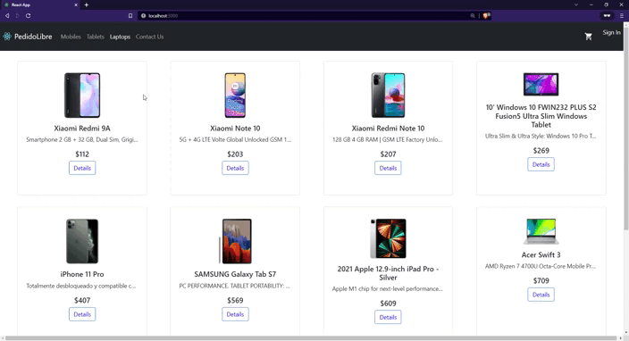

# Pedro-Porteiro

# About the Project: 📚

This e-commerce was made as the final project of React Course from CoderHouse.  
It shows a gallery with different products and categories which can be used as filters. 
When choosing a product, more information will be shown and a counter to choose the amount you want to add to cart. After adding the desired product to cart, you can modify the amount or delete the product from cart.  
In cart view you'll see all the products you added, you can change the quantity for each item, remove the product from the cart, apply a promotional code (not implemented yet) or checkout.  
If you checkout, you'll be asked for some information (name, email, phone) which will be attached to the order.
If the order was placed succesfully, you'll be redirected to a new page with a confirmation message.
 
The project uses Firebase to store the data of the products and information of the orders.

# The project looks like this: 📷

# Technologies Used:

## 💻 JavaScript  

## ⚛️ React Js  

## TailwindCSS

## Firebase

# Firestore

Details for the structure of the information in Firestore:

### Products

| Field       | Type   | Value       |
| ----------- | ------ | ----------- |
| title       | String | title       |
| description | String | description |
| pictureUrl  | String | image URL   |
| category    | String | category    |
| price       | Number | price       |
| stock       | Number | stock       |

### Categories

| Field       | Type   | Value           |
| ----------- | ------ | --------------- |
| id          | String | id              |
| description | String | description     |
| linkNumber  | Number | ordering number |

### Orders

| Field | Type   | Value                    |
| ----- | ------ | ------------------------ |
| buyer | Object | Buyer data               |
| date  | Date   | Date of creation         |
| items | Array  | Array of objects in cart |
| total | Number | Total cost               |

# Setup / Installation: 💻

Use the following commands for setup and installation.

### `git clone git@github.com:pporteiro/ecommerce-Porteiro.git`

### `cd ecommerce-Porteiro`

### `npm install`

### `npm start`

This will run the app in the development mode.\
Open [http://localhost:3000](http://localhost:3000) to view it in your browser.

# Status: 📶

The project is complete for the course meeting all the requirements listed. Still it's under development.  
Next steps will be to redesign the whole web using TailwindCSS to learn about it and adding authentication to fill buyers data from user information and implement promotional codes.

# Credits: 📝

Thanks to CoderHouse for the great course, to [<b>Sebastián</b>](https://www.linkedin.com/in/sebastian-zuviria/) for being an amazing teacher, to <b>Romina</b> for her dedication as a tutor, and to every other student for their help and support!
